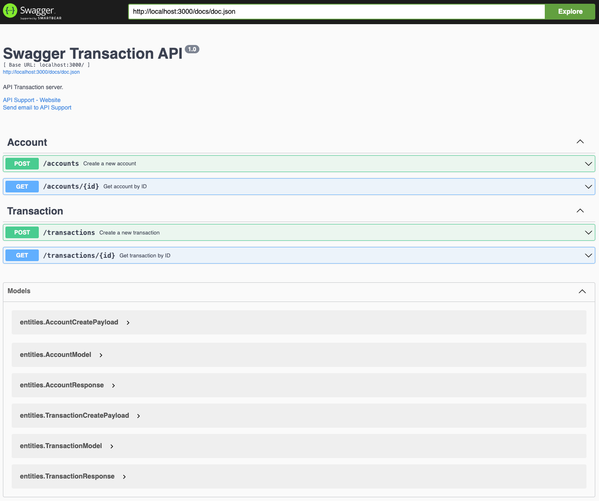
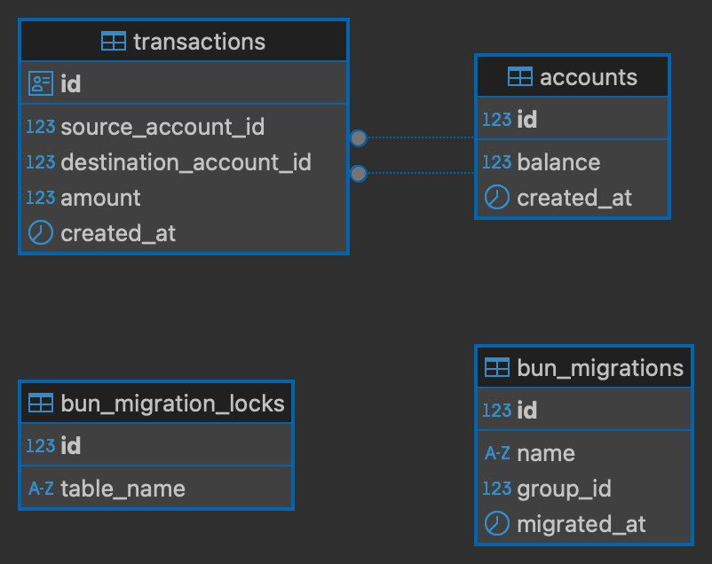

# Intrans
> A mini app for simulate internal transfer system, build with Golang and Postgres.

## How to

- Prepare the environment variables, copy from `.env.example` and rename to `.env`
- Run `go mod tidy`
- Available commands:

    ```shell
    # Development
    go run main.go

    # Production
    go build .
    ./intrans

    # Run test
    make test

    # Run test verbose
    make test.cover

    # Run test coverage
    make test.cover.out

    # Run test html
    make test.cover.html
    ```
- With docker

    ```shell
    # Build image
    docker build -t intrans .

    # Run the container
    # Please replace `<PORT>` and `<DB_DSN>` with yours
    # Note: If want to connect to database in host machine, please use `host.docker.internal`
    docker run --name intrans-app -e PORT=<PORT> -e DB_DSN=<DB_DSN> -p <PORT>:<3000> intrans
    ```

## Features
- Rest APIs
- Swagger Documentation available at `/docs`
- Unit tests
- Dockerize

### Swagger


### Schema
